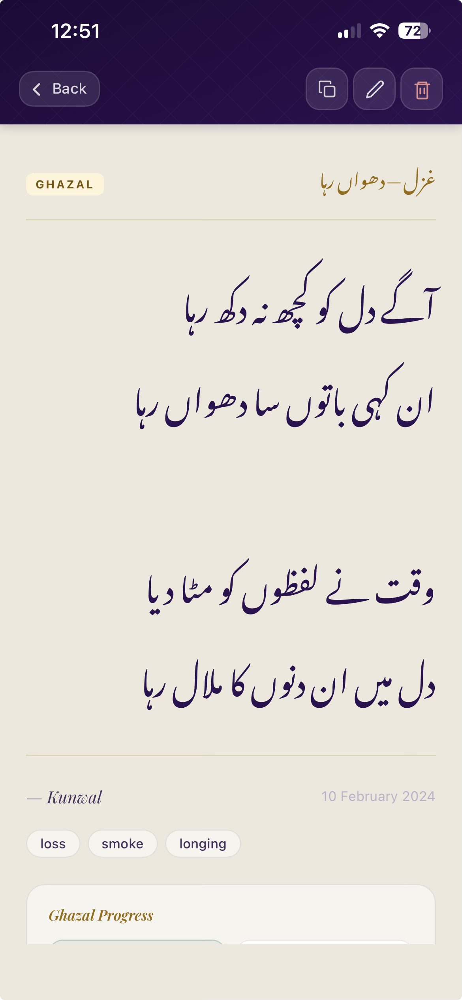
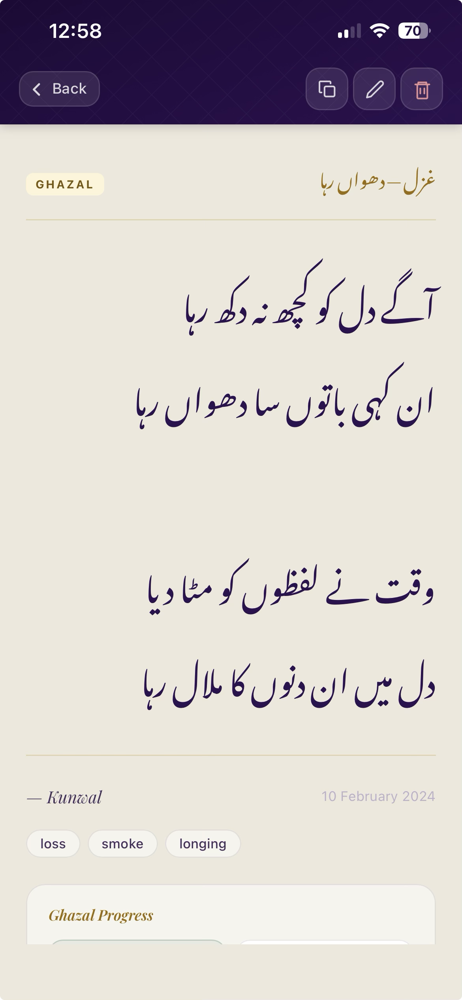

# Kunwal ke Phool — Designer Brief
### کنول کے پھول

**Version:** 2.1.0 · **Date:** June 2026  
**Prepared for:** Visual designer / UI redesign  
**Prepared by:** Development team

---

## 1. What This App Is

**Kunwal ke Phool** (کنول کے پھول — "Lotus Flowers") is a personal poetry diary PWA (Progressive Web App) built for **Kunwal**, a poet who writes in Urdu.

It is a private, offline-first app — no accounts, no server, data lives on the device. It installs to the iPhone home screen and runs like a native app.

### The Poet's Three Needs

| Entry Type | Urdu | What It Is |
|---|---|---|
| **Sher** | شعر | A couplet — two lines, a complete thought. Kunwal's own work. |
| **Ghazal in Progress** | غزل | A ghazal being composed. Has a structured workshop checklist (metre, radif, qafia, etc.) |
| **Mehfil** | محفل | Poems by other poets she admires — Parveen Shakir, Ghalib, Faiz, Mir. |

### Tone & Personality

This is an intimate, personal creative tool. It should feel like a beautiful **handwritten journal** — private, warm, literary. Not a social app. Not a productivity tool.

Words that describe the right feel: *intimate, elevated, handcrafted, classical, warm, unhurried*.

---

## 2. Current Design System

### Colour Palette

**Plum family** (primary — brand, text, headers, badges)

| Token | Hex | Usage |
|---|---|---|
| `--plum-950` | `#130624` | Deepest backgrounds |
| `--plum-900` | `#1E0A38` | Header gradient start |
| `--plum-800` | `#2D1050` | Header gradient mid, body text, plum badge |
| `--plum-700` | `#3F1870` | Header gradient end, hover accent line |
| `--plum-200` | `#C8A8E8` | Light accents |
| `--plum-100` | `#EDE0F8` | Sher badge background |

**Gold family** (accent — interactive elements, gold accents, computed indicators)

| Token | Hex | Usage |
|---|---|---|
| `--gold-700` | `#7A5500` | Dark gold text |
| `--gold-600` | `#9A6C00` | Card title Urdu text |
| `--gold-500` | `#B8860B` | Tab underline, FAB gradient, borders |
| `--gold-400` | `#D4A017` | FAB gradient top |
| `--gold-300` | `#E8C040` | App title, toast action buttons |
| `--gold-100` | `#FDF5D8` | Ghazal badge background |

**Teal family** (Mehfil / saved-poem accent)

| Token | Hex | Usage |
|---|---|---|
| `--teal-700` | `#0E3344` | Dark teal |
| `--teal-600` | `#155366` | Mehfil badge text, saved-poem author name |

**Surfaces**

| Token | Hex | Usage |
|---|---|---|
| `--bg` | `#EDE8DC` | App background (warm parchment) |
| `--surface` | `#FFFFFF` | Cards, inputs, tab bar |
| `--surface-2` | `#F7F4EE` | Tag chips, secondary surfaces |
| `--surface-3` | `#EFEAE0` | Tertiary surfaces |

**Ink (text)**

| Token | Hex | Usage |
|---|---|---|
| `--ink-1` | `#180828` | Primary body text |
| `--ink-2` | `#4A3060` | Secondary text, author names |
| `--ink-3` | `#8C7A9C` | Muted labels, placeholders |
| `--ink-4` | `#C0B0CC` | Timestamps, de-emphasised text |

**State colours:** Green `#13623A` / Red `#8B1818`

---

### Typography

Three typefaces are in use:

#### 1. Noto Nastaliq Urdu — `var(--font-urdu)`
- **Purpose:** All Urdu text throughout the app
- **Source:** Google Fonts
- **Weights used:** 400, 700
- **Direction:** RTL (right-to-left), text-align: right
- **⚠️ Critical constraint — see Section 5**

#### 2. Playfair Display — `var(--font-display)`
- **Purpose:** Display headings, English author names, detail English translations, empty states
- **Source:** Google Fonts
- **Styles used:** Regular, Italic, SemiBold, SemiBold Italic
- **Character:** Classic editorial serif — pairs beautifully with Nastaliq's organic curves

#### 3. System UI — `var(--font-ui)`
- **Purpose:** All UI chrome — tabs, buttons, search, tags, timestamps, labels
- **Value:** `-apple-system, BlinkMacSystemFont, 'Segoe UI', Roboto, sans-serif`
- **Renders as** SF Pro on iPhone

#### Current Font Size Scale

| Context | Size | Font |
|---|---|---|
| App title (header) | 1.9rem | Nastaliq |
| Detail Urdu poetry | 1.25rem | Nastaliq |
| Card Urdu preview | 1rem | Nastaliq |
| Card title (Urdu) | 0.85rem | Nastaliq |
| Tabs | 0.8rem | System UI |
| Tags, metadata | 0.65–0.7rem | System UI |

---

### Spacing & Geometry

| Token | Value | Usage |
|---|---|---|
| `--r-s` | 6px | Badges, small chips |
| `--r-m` | 12px | Inputs |
| `--r-l` | 16px | Cards, large containers |
| `--r-xl` | 22px | Search bar |
| `--r-f` | 999px | Pills, FAB, tab underline caps |

Card padding: `18px 18px 14px`  
Entry list gap: `10px`  
Page horizontal padding: `16px`

---

### Elevation

Three layers, all plum-tinted:

```
--elev-1:  0 1px 2px rgba(19,6,36,.05), 0 2px 8px rgba(19,6,36,.06)   ← cards, inputs
--elev-2:  0 2px 4px rgba(19,6,36,.06), 0 6px 20px rgba(19,6,36,.09)  ← hovered cards
--elev-3:  0 4px 10px rgba(19,6,36,.09), 0 16px 44px rgba(19,6,36,.13) ← modals, toasts
--elev-gold: 0 4px 14px rgba(184,134,11,.35), 0 2px 4px rgba(0,0,0,.1) ← FAB
```

---

## 3. Screen Inventory

The app has four full-screen views that slide in/out. On iPhone it is fullscreen standalone (no browser chrome).

---

### Screen 1 — Home (List View)

```
┌─────────────────────────────────┐
│  APP HEADER (plum gradient)     │
│  کنول کے پھول        [⚙]        │
│  kunwal ke phool  (tagline)     │
├─────────────────────────────────┤
│  TAB BAR (white surface)        │
│  [My Sher] [My Ghazals][Mehfil] │
│              ———gold underline  │
├─────────────────────────────────┤
│  SEARCH BAR                     │
│  🔍 Search your shayari…        │
├─────────────────────────────────┤
│  TAG FILTER PILLS (scrollable)  │
│  [longing] [smoke] [loss] …     │
├─────────────────────────────────┤
│  ENTRY LIST (scrollable)        │
│  ┌─────────────────────────┐    │
│  │ [SHER badge]            │    │
│  │ آگے دل کو کچھ نہ دکھ رہا│    │
│  │ ان کبھی باتوں سادھواں   │    │
│  │ ─────────────────       │    │
│  │ [longing] [smoke]  date │    │
│  └─────────────────────────┘    │
│  (more cards…)                  │
├─────────────────────────────────┤
│                      [+ FAB]    │
└─────────────────────────────────┘
```

**Header:** Deep plum gradient (`#1E0A38 → #3F1870`) with a subtle SVG diamond grid texture at 4% opacity. App title in Nastaliq gold. Settings icon top-right (frosted glass square button).

**Tab bar:** White surface. Three tabs: My Sher, My Ghazals, Mehfil. Active tab is plum-800, inactive is ink-3. Animated gold underline bar slides between tabs.

**Cards:** White surface, 16px radius, `elev-1` shadow. On hover: lift (`translateY(-1px)`), `elev-2`, inset border turns gold, plum→gold gradient accent line appears at top. Each card shows:
- Type badge (top-left): `SHER` (plum), `GHAZAL` (gold), `MEHFIL` (teal)
- Urdu title (for ghazals) in gold-600 Nastaliq
- Up to 2 lines of Urdu preview in plum-800 Nastaliq
- "+N more lines" count if applicable
- Ghazal progress row (for ghazal type: sher count, matla/maqta status)
- Thin horizontal rule separator
- Tag chips, author (if Mehfil), date

**FAB:** 58px circle, gold gradient, gold shadow. Bottom-right. Opens the Add Entry form.

---

### Screen 2 — Add / Edit Form

```
┌─────────────────────────────────┐
│  SUB-HEADER (plum gradient)     │
│  ← Back    New Entry            │
├─────────────────────────────────┤
│  FORM (scrollable)              │
│                                 │
│  Type                           │
│  [Sher] [Ghazal] [Mehfil]      │
│                                 │
│  Title (optional)               │
│  ┌──────────────────────────┐   │
│  │                          │   │
│  └──────────────────────────┘   │
│                                 │
│  Urdu Text ★                   │
│  ┌──────────────────────────┐   │
│  │  یہاں لکھیں…             │   │
│  │  (RTL, Nastaliq)         │   │
│  └──────────────────────────┘   │
│                                 │
│  English Translation (optional) │
│  Tags / Author / Notes          │
│                                 │
│  — — GHAZAL SECTION — —        │  ← only visible when Ghazal type
│  Radif, Qafia chips             │
│  Structural Rules checklist     │
│  Quality Rules checklist        │
│  [Minimum 5 sher (auto) ◆]     │  ← gold computed checkbox, disabled
│                                 │
│  [Save Entry]                   │
└─────────────────────────────────┘
```

**Type selector:** Three pill buttons. Active state: plum-800 bg, white text. Inactive: surface-2, ink-2.

**Inputs:** White surface, 12px radius, `elev-1`. Gold border + `elev-2` on focus.

**Ghazal section:** Separated by gold section dividers (horizontal rules with centred label). Custom checkboxes (appearance: none): plum fill when manually checked, gold fill when auto-computed (the sher count threshold checkbox), disabled state in muted border-gold.

**Qafia chips:** User types Urdu words → chip with × remove button.

---

### Screen 3 — Detail View

```
┌─────────────────────────────────┐
│  SUB-HEADER (plum gradient)     │
│  ← Back          [⧉] [✎] [🗑] │
├─────────────────────────────────┤
│  DETAIL CONTENT (scrollable)    │
│                                 │
│  [GHAZAL badge]    غزل—دھواں رہا│  ← badge left, Urdu title right
│                                 │
│  ┌─ POETRY CARD ─────────────┐  │  ← white card, gold border
│  │  آگے دل کو کچھ نہ دکھ رہا │  │
│  │  ان کبھی باتوں سادھواں رہا│  │
│  │                           │  │
│  │  وقت نے لفظوں کو مٹا دیا  │  │  ← sher gap = 1.5rem margin
│  │  دل میں ان دنوں کا ملال رہا│  │
│  └───────────────────────────┘  │
│                                 │
│  — Kunwal          10 Feb 2024  │
│  [loss] [smoke] [longing]       │
│                                 │
│  ┌─ Ghazal Progress ─────────┐  │
│  │ [Matla ✓][Maqta –][5 sher]│  │
│  │ [Behr ✓][Radif ✓][Qafia ✓]│  │
│  │ [No repeat –][Image ✓]    │  │
│  │ [Stands alone ✓]          │  │
│  │                           │  │
│  │ Radif: رہا               │  │
│  │ Qafia: [دکھ][سادھ][مٹا]  │  │
│  └───────────────────────────┘  │
└─────────────────────────────────┘
```

**Sub-header action buttons:** Copy, Edit, Delete — frosted glass squares (38×38px, 10px radius).

**Poetry card:** White surface, `elev-1`, gold full border (1px `rgba(184,134,11,.22)`), 16px radius, `24px 20px` padding. Urdu text at 1.25rem Nastaliq, plum-800. Each sher (couplet) is a `<p>` block; sher gap is `1.5rem margin-top` (not a blank line).

**Byline:** Author in Playfair Display italic, date in ink-4 system UI. Author is prefixed with "—" dash.

**Ghazal progress grid:** 9 checks in a responsive wrap grid. Done items in plum background+white text, pending in surface-2+ink-3.

---

### Screen 4 — Settings

```
┌─────────────────────────────────┐
│  SUB-HEADER                     │
│  ← Back    Settings             │
├─────────────────────────────────┤
│  ┌───────────────────────────┐  │
│  │ Export Data (JSON)     →  │  │
│  └───────────────────────────┘  │
│  ┌───────────────────────────┐  │
│  │ Import Data (JSON)     →  │  │
│  └───────────────────────────┘  │
│  ┌───────────────────────────┐  │
│  │ Clear All Data         →  │  │  ← red destructive action
│  └───────────────────────────┘  │
└─────────────────────────────────┘
```

Simple settings list. No accounts, no sync — data lives entirely in localStorage.

---

## 4. Component Inventory

| Component | Description |
|---|---|
| App header | Plum gradient + diamond texture + Nastaliq title + settings icon |
| Sub-header | Same gradient, smaller. Back button (pill with chevron SVG), page title, action icons |
| Tab bar | White surface, 3 tabs, animated gold sliding underline |
| Search bar | White pill, 22px radius, SVG search icon, gold border on focus |
| Tag pills | Scrollable horizontal row. Active: plum filled |
| Entry card | White, 16px radius, 2-layer shadow, inset border via `::after`, hover accent via `::before` |
| Type badges | `SHER` (plum), `GHAZAL` (gold), `MEHFIL` (teal) — 0.6rem uppercase |
| Tag chips | Small pills, surface-2, border |
| FAB | 58px gold gradient circle, gold shadow, spring animation |
| Poetry card (detail) | White card with gold border — same language as list cards |
| Progress grid | 9 check items, 3-column wrap |
| Custom checkboxes | Plum fill (manual), gold fill (computed/auto), disabled state |
| Qafia chips | Urdu word chips with × remove |
| Toast | Plum-900 pill, bottom-center. Can carry a gold action button (Undo, Export) |
| Confirm dialog | Bottom-sheet modal with blur backdrop and drag handle |
| Empty state | Rose emoji ornament, Playfair Display heading, body text |

---

## 5. ⚠️ Critical Urdu Nastaliq Constraints

**This section is essential reading. Ignoring it will cause visual bugs on real devices.**

### Why Nastaliq is different from Latin fonts

Noto Nastaliq Urdu is a **calligraphic** font. Unlike Latin typefaces, it renders glyphs in a flowing, diagonal, connected style that descends from right to left. Its glyph metrics are extreme:

| Metric | Value | Meaning |
|---|---|---|
| WinAscent | 4282 | Glyphs rise far above the baseline |
| WinDescent | 2061 | Glyphs descend far below the baseline |
| UPM (Units per em) | 2048 | Font design unit scale |
| **Natural line height** | **(4282 + 2061) / 2048 = 3.1×** | Each line of Nastaliq text occupies ~3.1× the font-size in vertical space |

At `font-size: 1rem` (16px), a single line of Nastaliq occupies approximately **49px** of vertical space. At `1.25rem`, approximately **62px**.

### Rules for using Nastaliq in CSS

1. **Never set `line-height` below 3.1× the font-size.** Constraining the line box causes ink to overflow it and get clipped. At 1rem, the safe minimum is `line-height: 3.1` (49px). In practice: **omit `line-height` entirely** and let the font use its natural metrics.

2. **Never put `overflow: hidden` on a container that holds Nastaliq text** — on iOS Safari this also freezes the flex-item height calculation, collapsing cards. Use `overflow: visible` (default) and rely on border via `outline` or `box-shadow: inset` if you need a visual boundary.

3. **Nastaliq requires RTL layout.** All Urdu text elements must have `direction: rtl` and `text-align: right`. In a mixed layout (Arabic text + Latin UI), be careful with flex direction and margin/padding directional properties.

4. **Nastaliq and Latin cannot be sized the same.** At equal `font-size`, Nastaliq appears substantially larger than Latin because of its high ascenders and the calligraphic stroke weight. The current design uses `1rem` Nastaliq for card preview, `1.25rem` for the detail view — these were chosen specifically for iPhone screen density after real-device testing.

5. **Sher separation.** Each sher (couplet) in a ghazal is separated by a blank line. Do not use `<br><br>` or `white-space: pre-line` for this — the line gap at any reasonable Nastaliq size is enormous (~62px per line at 1.25rem). Instead use margin between paragraph elements (`margin-top: 1.5rem` between sher paragraphs gives a clean editorial gap).

6. **Font loading.** Noto Nastaliq Urdu must be loaded from Google Fonts before rendering. A `font-display: swap` strategy is used. On first load offline, Latin fallback (`serif`) will show until the font caches — design must tolerate this gracefully (ensure fallback serif has RTL support).

### Design implications

- **Cards must be tall enough to hold Nastaliq.** A 2-line preview at 1rem with natural line height = ~98px of text alone, plus header, footer. Cards are not small-and-dense in the way a Latin app card might be.
- **Don't fight the line height.** Embrace the generous vertical rhythm — it's part of the calligraphic aesthetic.
- **Right-to-left flow.** If you place Latin and Urdu on the same line (e.g., a badge left + Urdu title right), use `display: flex` with `align-items: center` rather than inline text — mixing directionality in a single text node causes bidi rendering issues.
- **Nastaliq strokes are organic, diagonal, and decorative.** The plum-on-white combination was chosen specifically because the dark ink on light surface gives maximum glyph legibility. Avoid placing Nastaliq on busy or low-contrast backgrounds.

---

## 6. Technical Constraints for Designers

| Constraint | What It Means for Design |
|---|---|
| **Pure HTML + CSS + Vanilla JS** | No React, no component library. All CSS must be hand-written. Give CSS values, not Figma component names. |
| **No build step** | No Tailwind, no SCSS. Plain CSS with custom properties. |
| **PWA on iPhone** | The viewport is the full phone screen. Account for iOS safe areas (notch top, home indicator bottom). The app runs in standalone mode — no browser address bar. |
| **Offline-first** | Fonts and assets are cached by a service worker. New fonts/icons must be cacheable (Google Fonts preferred). |
| **localStorage only** | No user accounts, no sync. Data is per-device. Settings are minimal by design. |
| **No backend** | No API calls. Everything is client-side. |
| **Three typefaces max** | Current: Nastaliq Urdu + Playfair Display + System UI. Adding a fourth font adds weight to the page load. |
| **iOS Safari primary target** | The primary user is on an iPhone. All interactive states (`hover`, `:active`, `:focus`) should consider touch — no hover-only affordances. Use `-webkit-tap-highlight-color: transparent` on interactive elements. |

---

## 7. Screenshots — Current Design

### Home / List View (current)
This screenshot shows the v2 design with cards working correctly on iPhone.



*Cards showing: SHER badge, Nastaliq preview text, tag chips, date. Warm parchment (#EDE8DC) background. White cards with plum shadow. Plum gradient header with gold Nastaliq title.*

### Detail View (reference — structure correct, screenshot is slightly older)


*Poetry card (white, gold border) inside parchment background. Badge + Urdu title header row. Byline (Playfair italic author + date). Tag chips. Ghazal progress section.*

> **Note to designer:** The screenshots above show the current app. The detail page has since been refined — the poetry now sits in a white card with a gold border (matching the list card style), Nastaliq is 1.25rem (smaller than shown), and sher are separated by controlled `1.5rem` margin rather than a blank line.

---

## 8. Open Design Opportunities

Areas where a designer could meaningfully improve the experience:

1. **Dark / night mode** — The poet writes at night. A dark palette variation (deep plum backgrounds, gold + parchment text) would be very welcome. The colour tokens are already structured for this.

2. **Completed ghazal state** — Currently all ghazals are "in progress." A visual treatment for a finished ghazal (different badge, different card style — perhaps gold instead of amber?) is needed.

3. **Statistics / Insights view** — How many sher written, most-used tags, earliest entry. This screen doesn't exist yet. Could feel like a beautiful annual report spread.

4. **Distraction-free writing mode** — A full-screen Urdu input with no chrome. Entering this mode should feel intentional and calm.

5. **Icons** — The current PWA icons (192×512px PNG) are lotus flower images. Higher-quality or more refined icons for the home screen and share sheet would improve the installed experience.

6. **Empty state illustrations** — Currently a rose emoji (🌹) with text. A small custom illustration or calligraphic ornament would be more characterful.

7. **Onboarding** — There is no onboarding. First-time users see an empty list. A brief welcome state (shown only once) could set the tone.

---

## 9. How to Deliver Your Work Back to the Developer

The developer will implement your designs directly in `styles.css` and `index.html`. To make this seamless, please provide:

### What to give

**Option A — Preferred: Annotated design file (Figma)**
- Share a Figma file with:
  - All four screens at iPhone 14 Pro dimensions (393 × 852pt, @3x)
  - Light mode as the primary frame
  - Dark mode frames if you are designing it
  - All interactive states visible (default, hover, active, focused)
  - Exact hex values for any new or changed colours
  - Exact font sizes in `rem` or `px` (not "Body Large" — actual numbers)
  - Spacing values in `px`
  - Any new CSS custom property names you want to introduce (e.g. `--surface-night`)

**Option B — CSS variables file**
If redesigning the colour palette or type scale, export a `.css` file with the new `:root {}` token block. The developer will swap it directly.

**Option C — Annotated screenshots / redlines**
Numbered annotations on screenshots with exact values. Acceptable for smaller changes.

### What to label

For each new or changed element, provide:
- Background colour (hex)
- Text colour (hex)
- Font family (must be one of the three in use, or justify a new one)
- Font size in `rem` or `px`
- Border radius in `px`
- Shadow (copy the `box-shadow` CSS value)
- Padding/margin in `px`

### What not to do

- Do not specify Nastaliq font sizes below `0.85rem` — glyphs become illegible
- Do not specify `line-height` for Nastaliq elements — leave it unset (natural metrics)
- Do not design layouts that require `overflow: hidden` on any element containing Urdu text
- Do not introduce a fourth Google Font without flagging it — service worker cache and load time are affected

### Nastaliq test sentence

When designing with Urdu placeholder text, use this sentence (from the app's seed data):

> دل ہنوز اُس کے خیال میں گم ہے

This contains a range of connected letterforms and tests line height, RTL alignment, and the font's descenders. Do not use Lorem Ipsum or transliterated Urdu.

### File to deliver

Please deliver one or more of:
- Figma share link (view access is fine)
- Exported PNG/PDF redline sheets
- A `.css` file of changed/new tokens

Send to the developer with the subject: **"Kunwal ke Phool — Design Delivery"**

---

## 10. App Vocabulary Reference

| Term | Urdu | Meaning |
|---|---|---|
| Sher | شعر | A couplet — the basic unit of Urdu poetry |
| Ghazal | غزل | A poem form: multiple sher with a shared radif and qafia |
| Mehfil | محفل | A poetic gathering; here: poems by other poets |
| Matla | مطلع | The opening sher of a ghazal (both lines end in radif) |
| Maqta | مقطع | The closing sher, containing the poet's pen name (takhallus) |
| Radif | ردیف | The repeated end-word or phrase in every sher |
| Qafia | قافیہ | The rhyming word that precedes the radif |
| Behr | بحر | Metre — the rhythmic pattern of the ghazal |
| Takhallus | تخلص | Pen name; Kunwal's is کنول (lotus) |

---

*This document was generated from the live codebase. Design tokens, component descriptions, and constraints reflect the actual implementation as of v2.1.0.*
